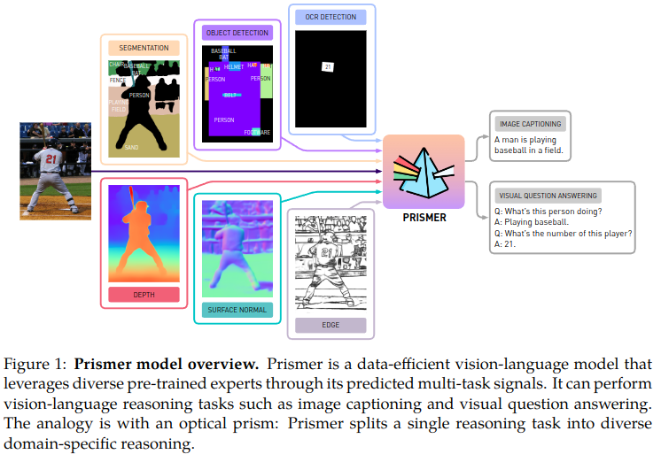
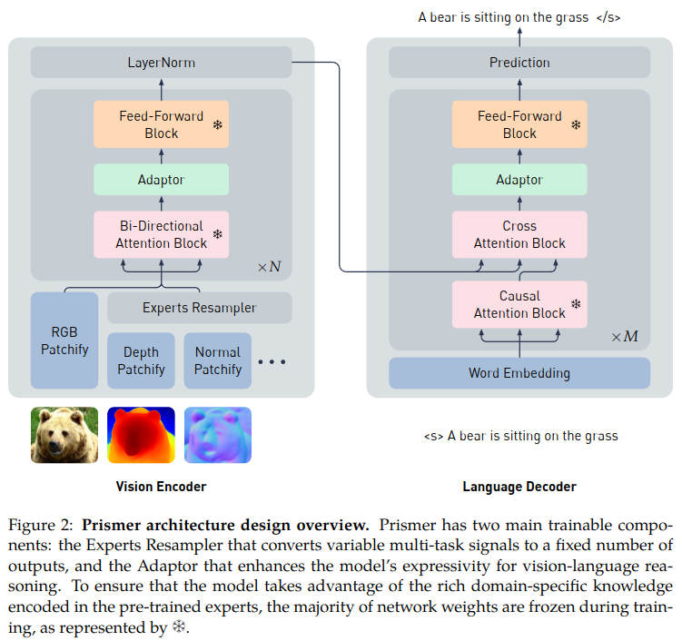
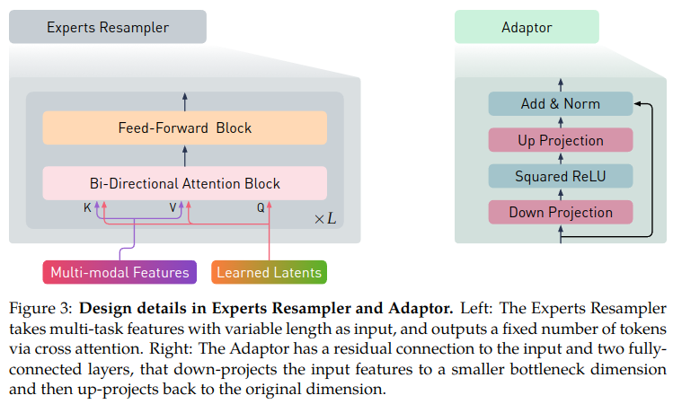
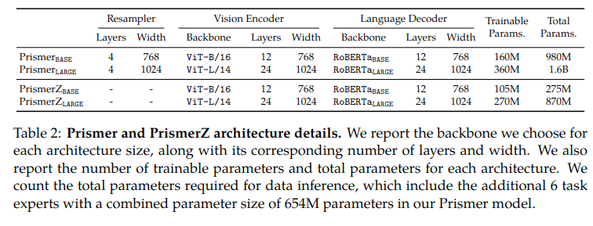
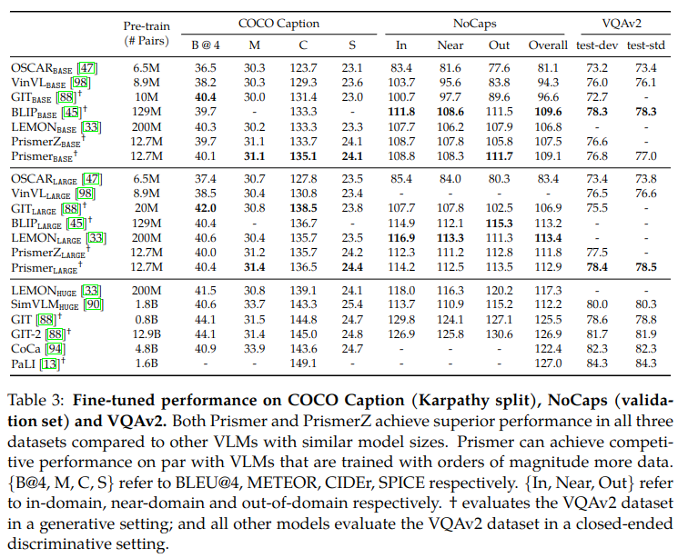
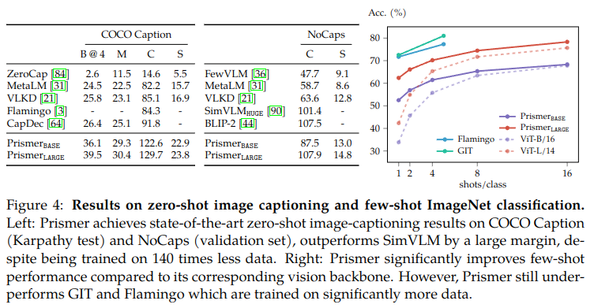
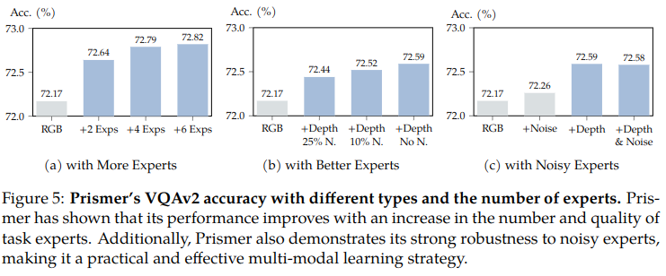
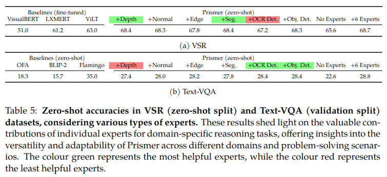
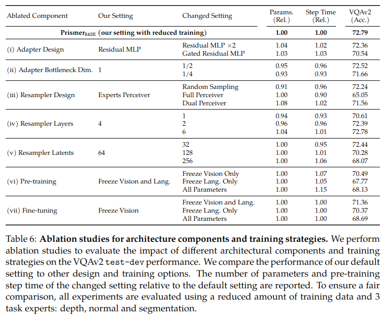

Abstract

Prismer là một mô hình vision-language yêu cầu ít dữ liệu và tham số

Prismer chỉ yêu cầu huấn luyện một số lượng nhỏ các thành phần, với phần lớn trọng lượng mạng được kế thừa từ những mạng sẵn có, được pre-trained, đóng băng trong quá trình huấn luyện

1 Introduction

Trong bài toán image captioning và visual question answering yêu cầu mô hình có khả năng nhận dạng, phát hiện, đếm, và nhận biết đối tượng 3D chi tiết

vấn đề đọc văn bản có thể được giải quyết dễ dàng bằng cách tận dụng OCR experts. Các vấn đề "nhận dạng đối tượng" có thể được giải quyết bằng cách tận dụng exprert phát hiện đối tượng

Giải pháp điển hình là sử dụng một lượng lớn dữ liệu hình ảnh - văn bản để huấn luyện một mô hình duy nhất khổng lồ học cách phát triển các kỹ năng một cách đồng thời dành riêng cho nhiệm vụ này từ đầu và trong cùng một kiến trúc chung

Thay vào đó, tác giả nghiên cứu một cách tiếp cận khác để học những kỹ năng, kiến trức lĩnh vực này thông qua các mạng con (experts) distinct and separate. Mỗi experts có thể được tối ưu hóa độc lập cho một nhiệm vụ cụ thể, cho phép sử dụng dữ liệu và kiến trúc theo miền cụ thể mà không thể thực hiện được với một mạng lớn duy nhất.

Prismer là một mô hình tạo văn bản autoregressive có điều kiện trực quan

Các yếu tố thiết kế chính của Prismer bao gồm:

- các mô hình vision-only và language-only mạnh làm backbones

- các mô hình vision-only bao gồm: 

+ low-level vision signals (depth)

+ high-level vision signals (instance and semantic labels)

Tất cả các experts được kết nết thông qua các thành phần trainable nhẹ (20% tổng số lượng tham số)

Primer có khả năng robust với những experts nhiễu

hiệu suất tăng khi tăng số lượng và chất lượng experts

3 Prismer

3.1 Model Overview

Phải mở rộng vision encoder để chấp nhận tín hiệu thị giác đa tác vụ

Phải biến đổi đầu ra của các experts để đưa vào vision encoder

Các experts đều được đóng băng

3.2 Pre-trained Experts

Backbone Experts

Task Experts

- Semantic Segmentation: Mask2Former - 215M

- Object Detection: UniDet - 120M

- Text Detection: CharNet - 89M

- Depth Estimation: DPT - 123M

- Surface Normal: NLL-AngMF - 72M

- Edge Detection: DexiNed - 35M

3.3 Key Architectural Components

Task-Specific Convolutional Stem

Experts Resampler

Lightweight Adaptor

3.4 Training Objective: predict the next token autoregressively

4 Experiments

4.1 Prismer Model Variants

PrismerZ: cắt bỏ phần Experts Resampler

sử dụng ViT pre-trained bằng CLIP làm vision encoder

sử dụng RoBERTa làm language Decoder ????

4.2 Training and Evaluation Details

Pre-training Datasets: COCO, Visual Genome, Conceptual Captions, SBU captions, Conceptual 12M

Optimisation and Implementation: Adamw, ZeRO Stage 2 technique, Automatic Mixed Precision

Evaluation Setting

4.3 Results on Vision-Language Benchmarks

Fine-tuned Performance on COCO Caption, NoCaps and VQAv2

Zero-shot Performance on Image Captioning; Few-shot Performance on ImageNet Classification

"A photo of a [CLASS NAME]"

5 Additional Analysis

5.1 Intriguing Learning Strategy of Prismer

More Expert, Better Performance

Better Experts, Better Performance

Robustness to Noisy Experts

5.2 Utility of Task Experts

5.3 Architecture Design and Training Details

Adaptor Design and Size

Resampler Design and Multi-modal Sampling Strategy

The Effect of Frozen Backbones

6 Conclusions, Limitations and Discussion

Multi-modal In-context Learning

Zero-shot Adaptation on New Experts

Free-form Inference on Partial Experts

Representation of Expert Knowledge